# Microsoft Excel Task
 On my first task on excel i was asked to create a table with 20 rows of information having the fields below.

*Employee id

*Employee full name

*Department(communication,sales,iT)

*salary(between $5000 to $25000)

*jobtype(part-time,freelance,contract)

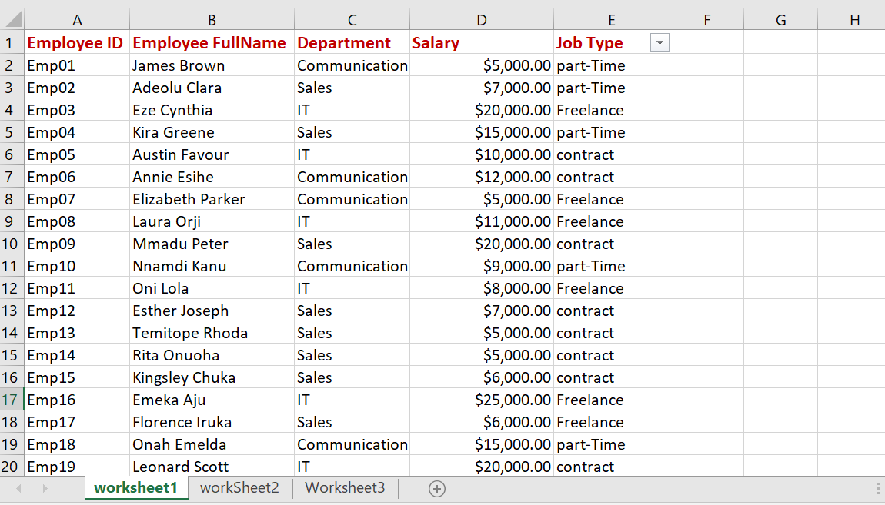

#### copy and paste table into worksheet 2 and worksheet 3

##### In worksheet 1,show only employees who are 'freelancers'  

 so i used the filter option to callout only the freelancers

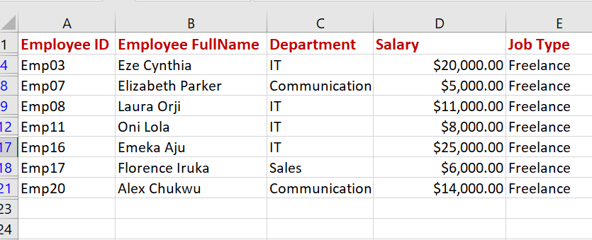

#### In worksheet 2, split the 'employeees' full names into first name and last name. check for duplicate and highlight if any

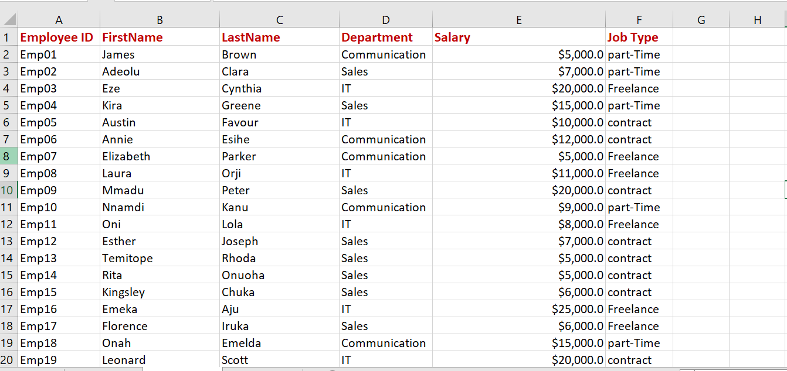

#### In worksheet 3, highlight employees whose nams begin with letter 'E'. format the salary column such that the highest SALARY has a green background and the lowest SALARY has a red background.

i used the filter option again to select the names that starts with the letter 'E'

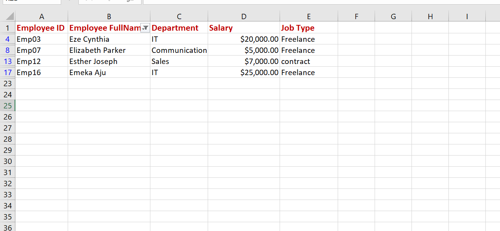 

then used conditional formating to highlight the highest salary(on green) and the lowest salary(on red)

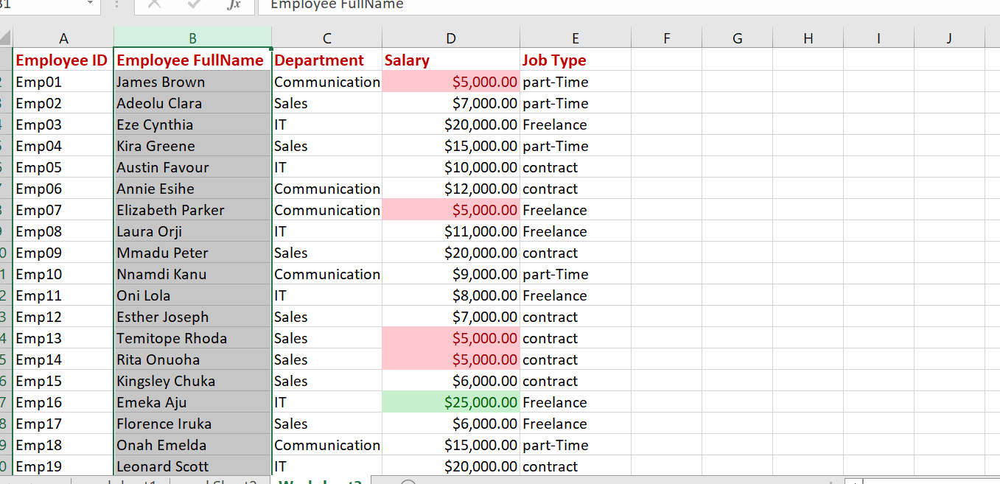 

## Then the second task,i was given this sales dataset and asked to determine the following

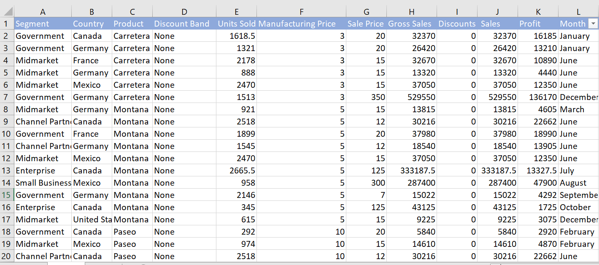

and asked to determine the following

* The total Revenue and profit generated
* The average Revenue and unit sold for every order
* The total discount given in $
* The total number of sales recorded
* The highest profit generated

  using the window functions (max,sum,count,average), i was able to answer them to arrive at this solutions

  

  then i was also asked to create a new column named 'sales range', and to return 'high sales' if the sale value is above average,otherwise return as 'low sales'
  so using the If function i arrived at this

  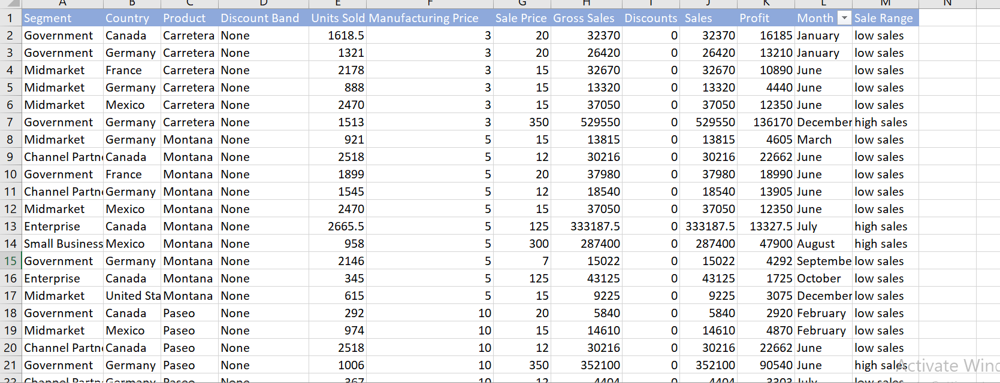
  

  
  

## The third task was still based on the same sales dataset,
i was asked to calculate;

* The average revenue generated from each sale of 'paseo'
* The number of sales made in the government and midmarket segment
* The total revenue generated from the sales of 'montana' in canada
* In which country,segment and month was the highest unit of goods sold?
* What is the total profit made in december?

So here are the visuals of the solution to the questions,using the average,count,sum,sumif function i was able to get the answers

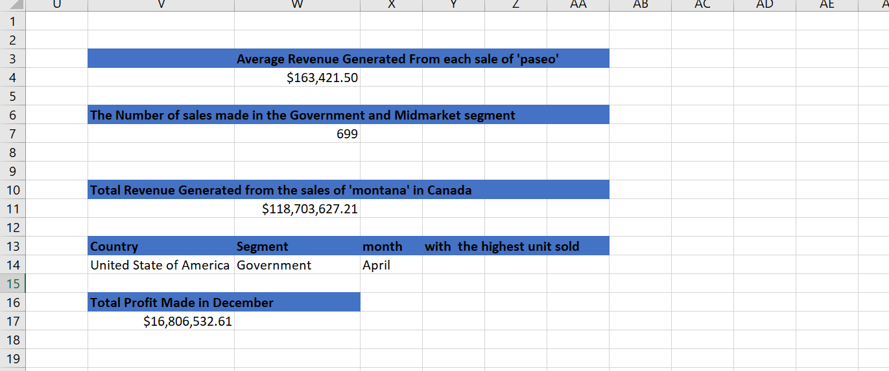

  to get the number of revenue generated from 'montana' in canada, i filtered the 'segment' column as shown below

  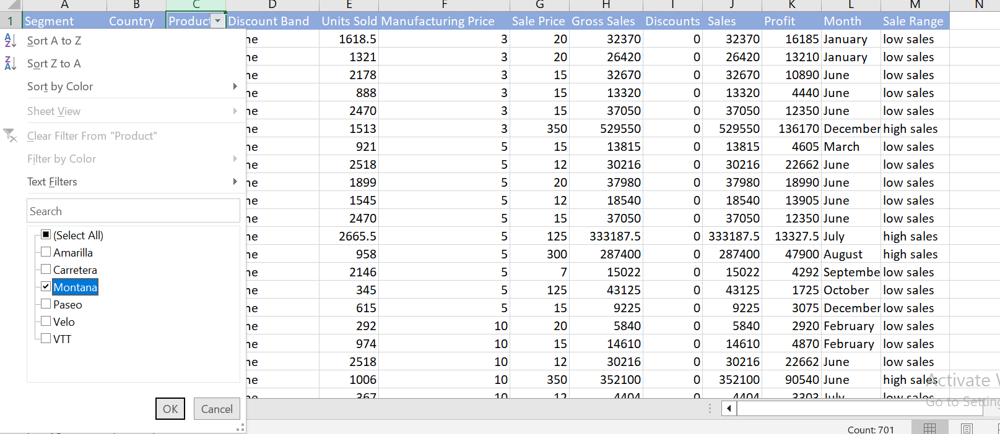
  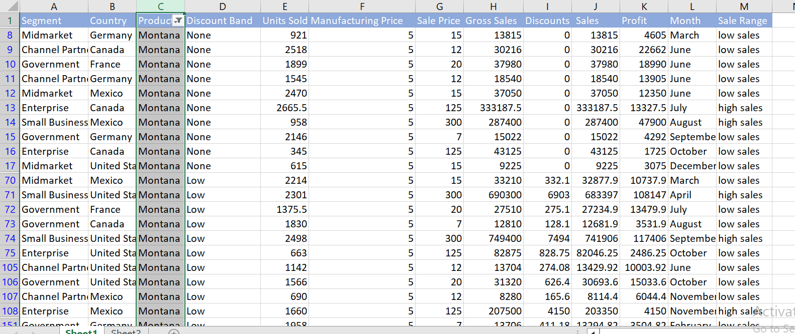

i forgot to mention that i useb conditional formating to highlight and find out the highest unit of goods sold, which is 4492 unit

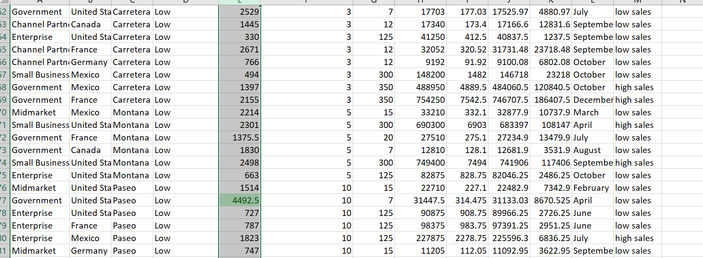

so i hope i did justice to the task, and would also appreciate review and comments.

  

